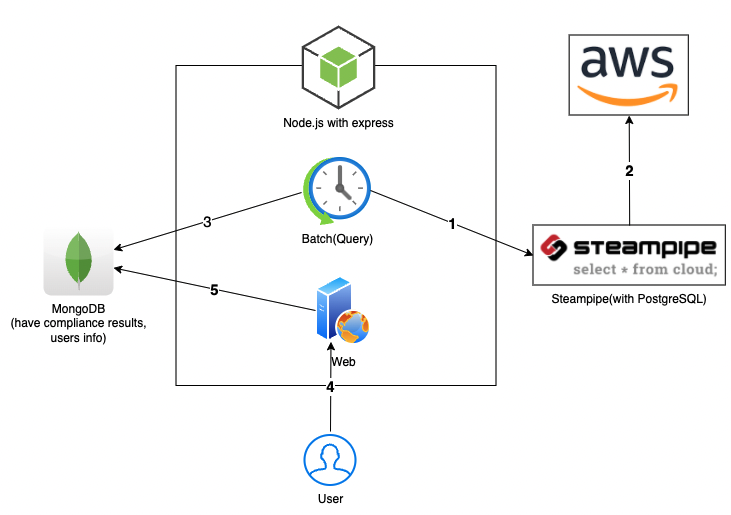
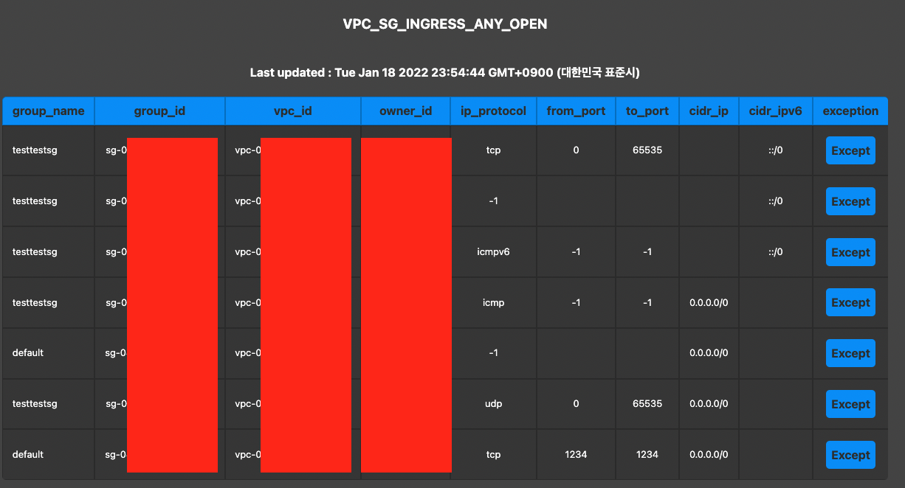

# cloud-security-platform-web-with-steampipe

## Simple Architecture



## Example



## Tech Stacks

- Node.js + MongoDB + Steampipe

## <font color="red">WARNING</font>

- DO NOT USE SSH FUNCTION.
- THIS FUNCTION IS BEING TESTED NOW!!!

## Usage

- If you use ec2, no need credentils, config files.
- If you use local machine? please refer to this <a href="#add_info">link</a>.

```bash
##### Development #####
$ ./dev-run.sh # Before, You have to install NodeJS, Steampipe, MongoDB on your local machine.

##### Production #####
$ cd terraform
$ terraform apply # Modify code on your environment fittly.

...
Access your ec2 using Session Manager.
Execute the command below.
You may need sudo command.(ex. sudo ./run.sh)
...

$ git pull https://github.com/cjsrkd3321/cloud-security-platform-web-with-steampipe
$ cd cloud-security-platform-web-with-steampipe
$ ./run.sh
$ curl http://localhost:2000

<!DOCTYPE html ><html lang="ko"><head><title>Login | CSPW2S</title><link rel="stylesheet" href="https://unpkg.com/mvp.css"/></head><body><header></header><main><form method="POST"><input placeholder="Username" name="username" type="text" required="required"/><input placeholder="Password" name="password" type="password" required="required"/><input type="submit" value="Login"/></form><hr/><div><span>Don't have an account?&nbsp;</span><a href="/join">Create one now &rarr;</a></div></main><footer>&copy; 2022 CSPW2S</footer></body></html>
```

## <span id="add_info">Additional information</span>

- If you can use instance-profile(ex. EC2 etc...) no need credentials.
- AWS profile need to "default".

  ```bash
  # credentials
  [default]
  aws_access_key_id = ACCESS_KEY_ID
  aws_secret_access_key = SECRET_ACCESS_KEY

  # config
  [default]
  region = ap-northeast-2
  output=json
  ```

- <b>You need related credentials files are below when run in local machine.</b>
  - <font color="red">Move</font> /root/.aws/credentials <font color="red">&rarr;</font> ./credentials
  - <font color="red">Move</font> /root/.aws/config <font color="red">&rarr;</font> ./config
  - "/root" is You can switch to the path where your credentials are.
- [Steampipe Docs](https://steampipe.io/docs)
