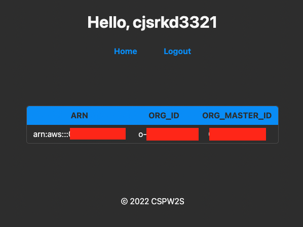

# cloud-security-platform-web-with-steampipe

## Home



## Tech Stacks

- Node.js + MongoDB + Steampipe

## Usage

- If you use ec2, no need credentils, config files.

```bash
$ cd terraform
$ terraform apply # Modify code on your environment fittly.

...
Access your ec2 using Session Manager.
Execute the command below.
You may need sudo command.(ex. sudo ./run.sh)
...

$ ./run.sh
$ curl http://localhost:2000

<!DOCTYPE html ><html lang="ko"><head><title>Login | CSPW2S</title><link rel="stylesheet" href="https://unpkg.com/mvp.css"/></head><body><header></header><main><form method="POST"><input placeholder="Username" name="username" type="text" required="required"/><input placeholder="Password" name="password" type="password" required="required"/><input type="submit" value="Login"/></form><hr/><div><span>Don't have an account?&nbsp;</span><a href="/join">Create one now &rarr;</a></div></main><footer>&copy; 2022 CSPW2S</footer></body></html>
```

## Additional information

- If you can use instance-profile(ex. EC2 etc...) no need credentials.
- [Steampipe Docs](https://steampipe.io/docs)
